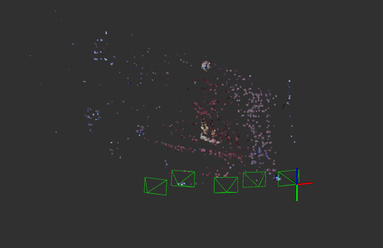

# Structure from Motion

<p align="center">
  
  <br>
  <em>Poses of five cameras from the small_dataset and the obtained point cloud – resolving issues related to bundle adjustment and PnP should yield better results.</em>
</p>

This repository contains an implementation of a Structure from Motion (SfM) approach for estimating camera poses and 3D landmarks from a set of cameras with known intrinsics. The solution is wrapped in a ROS2 node, and camera poses and the estimated point cloud are visualized in **RViz2**.

## Running the Code

Create a workspace and clone the repository:

```bash
mkdir -p ws/src
cd ws/src
git clone <this-repository>
```

Build the ROS2 package:

```bash
cd ..
colcon build
source install/local_setup.bash
```

Run the nodes:

```bash
ros2 run sfm sfm_node
```

```bash
ros2 run rviz2 rviz2
```

Execute the following command to publish the transformation from the map to the world coordinate frame (enables proper visualization):

```bash
ros2 run tf2_ros static_transform_publisher 0 0 0 0 0 -1.5708 map world
```

## Implementation Details

As mentioned before, the program expects a set of images depicting the same scene with known camera intrinsics. Each image is processed sequentially, its pose is estimated, and newly reconstructed 3D points are appended to the existing point cloud. The complete processing pipeline is as follows:

1. Train a DBoW2 bag-of-words database to enable efficient retrieval of the top-k most similar images to a query image.
2. Randomly choose the first image. Additionally, using the previously trained database, find the most similar image to the initially selected image.
3. Estimate the relative motion between the two images using epipolar geometry. This step involves:
   - detecting and matching features between the two images
   - estimating the Essential matrix using RANSAC
   - decomposing the Essential matrix into a rotation matrix and a translation vector
   - triangulating matched features with the known pose to obtain an initial point cloud
4. For all remaining images, perform the following steps:
   - using the trained database, find the most similar image to the previously processed one
   - estimate the pose of the new image using PnP with known 3D–2D correspondences
   - match features between the newly added image and all previously processed images, triangulate the matches, and add them to the point cloud

## TODO

- Correctly integrate bundle adjustment into the pipeline – it is implemented using the **g2o** library, but there is currently a bug.
- Fix a bug related to PnP – the number of valid 3D–2D correspondences entering the PnP procedure rapidly decreases as more images are processed.
